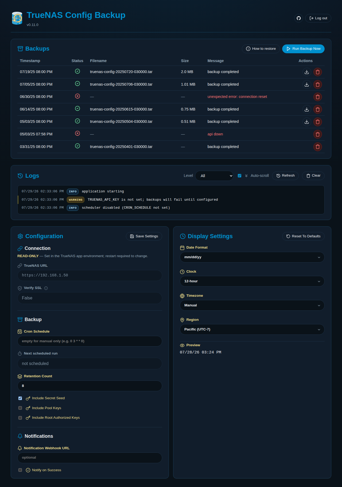

<p align="center">
  
</p>

# TrueNAS Config Backup

Scheduled backups of a TrueNAS system's configuration, downloaded via the TrueNAS
API, with retention pruning, run-history logging, and a small web dashboard.
Install on TrueNAS SCALE 24.10+ via **Custom App** (native Docker).

<p align="center">
  
</p>

## What it does

- Calls `config.save` over the TrueNAS JSON-RPC WebSocket API (via `core.download`)
  to produce a config backup tar, authenticating with an API key.
- Runs on an optional cron schedule (APScheduler) when `CRON_SCHEDULE` is set, and supports an on-demand "run now".
- Prunes old backups down to a configurable retention count.
- Logs every run (success/failure) to a jsonl history file.
- Serves a dashboard to view/download/delete backups and see run history.
- Exposes `GET /healthz` for container health checks.

Note: TrueNAS SCALE 25.04 deprecated the old synchronous REST config-save endpoint
(removed in 26). This app uses the current WebSocket + `core.download` flow instead.

## Documentation

| Guide | For |
|---|---|
| [Installation](docs/installation.md) | Deploy on TrueNAS SCALE |
| [Configuration](docs/configuration.md) | All env vars and options |
| [Restore](docs/restore.md) | Upload backups back to TrueNAS |
| [Development](docs/development.md) | Local dev, tests, builds |
| [Contributing](CONTRIBUTING.md) | Releases and commit format |
| [Security](SECURITY.md) | Auth, secrets, reporting |

## Quick start

On TrueNAS SCALE 24.10+, deploy as a **Custom App**:

1. **Apps → Discover Apps → Custom App**.
2. Set the image to `ghcr.io/campasachamp/truenas-config-backup:latest`
   (or pin a [release tag](https://github.com/CampAsAChamp/truenas-config-backup/releases)).
3. Mount host-path volumes at `/backups` and `/config` for backup storage and run history.
4. Set at minimum:
   - `TRUENAS_URL` — e.g. `https://127.0.0.1` or the host LAN IP
   - `TRUENAS_API_KEY` — from **My API Keys** in TrueNAS ([guide](docs/installation.md#creating-a-least-privilege-api-key))
   - `DASHBOARD_PASSWORD` — password for the web dashboard
5. Publish port **8080** to reach the dashboard.

See [Installation](docs/installation.md) for the full wizard steps, compose YAML example, API key setup, and upgrade notes.

## Repository layout

```
docs/                             Documentation and brand assets
app/
  src/app/                        FastAPI backend (Python package, templates, static)
  tests/                          pytest unit and integration tests
Dockerfile, requirements.txt      Container build
ix-dev/community/truenas-config-backup/
                                  TrueNAS apps-format definition (app.yaml, questions.yaml,
                                  ix_values.yaml, Jinja2 compose template)
.github/scripts/, library/        Vendored truenas/apps tooling for local render/validate
```
