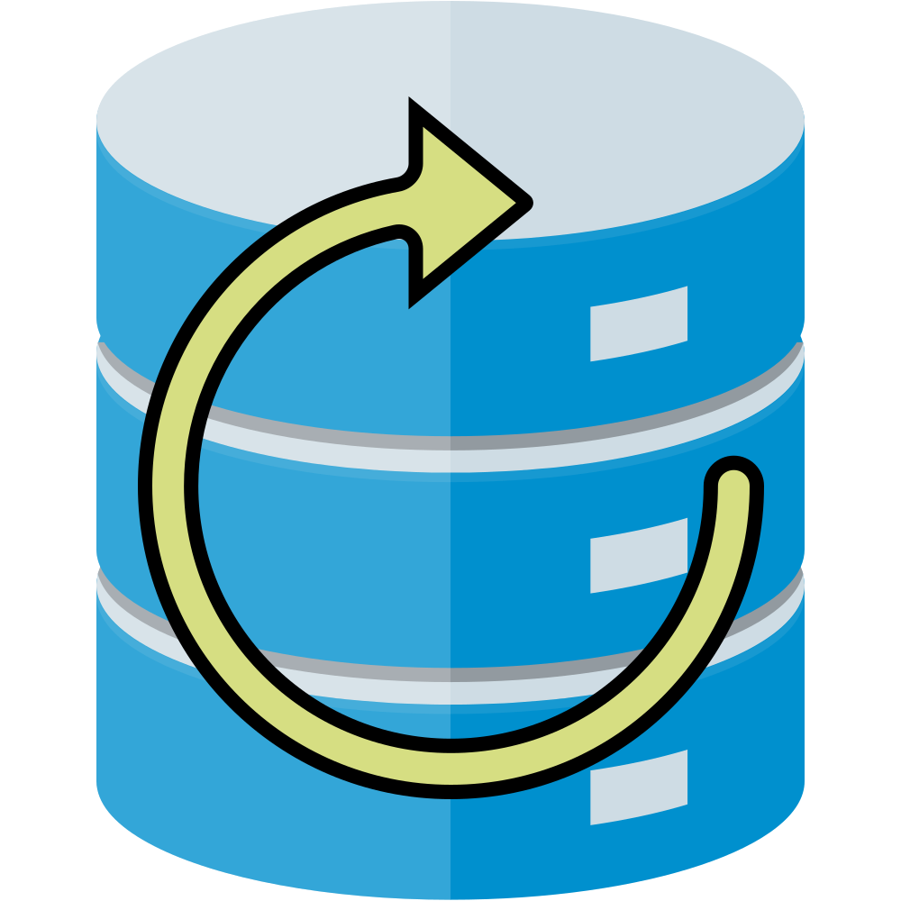
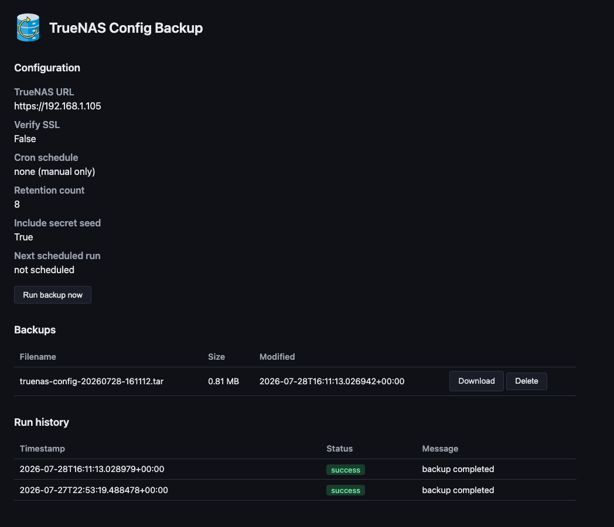

<p align="center">
  
</p>

# TrueNAS Config Backup

Scheduled backups of a TrueNAS system's configuration, downloaded via the TrueNAS
API, with retention pruning, run-history logging, and a small web dashboard.
Install on TrueNAS SCALE 24.10+ via **Custom App** (native Docker).

<p align="center">
  
</p>

## What it does

- Calls `config.save` over the TrueNAS JSON-RPC WebSocket API (via `core.download`)
  to produce a config backup tar, authenticating with an API key.
- Runs on an optional cron schedule (APScheduler) when `CRON_SCHEDULE` is set, and supports an on-demand "run now".
- Prunes old backups down to a configurable retention count.
- Logs every run (success/failure) to a jsonl history file.
- Serves a dashboard to view/download/delete backups and see run history.
- Exposes `GET /healthz` for container health checks.

Note: TrueNAS SCALE 25.04 deprecated the old synchronous REST config-save endpoint
(removed in 26). This app uses the current WebSocket + `core.download` flow instead.

## Repository layout

```
logo.svg, logo.png, dashboard.png  Brand assets (logo also served from app/static/ in the dashboard)
app/                              FastAPI backend (the container's application code)
tests/                            pytest unit and integration tests for app/
Dockerfile, requirements.txt      Container build
ix-dev/community/truenas-config-backup/
                                  TrueNAS apps-format definition (app.yaml, questions.yaml,
                                  ix_values.yaml, Jinja2 compose template) — used to render
                                  and validate the Custom App compose locally (see below)
.github/scripts/, library/        Vendored truenas/apps tooling used to render/validate the
                                  app definition locally (see below)
```

## Running the backend locally

```bash
python3 -m venv .venv
source .venv/bin/activate
pip install -r requirements.txt

BACKUP_DIR=/tmp/backups CONFIG_DIR=/tmp/config \
TRUENAS_URL=https://127.0.0.1 TRUENAS_API_KEY=your-api-key \
  uvicorn app.main:app --host 0.0.0.0 --port 8080
```

Then visit `http://localhost:8080`.

### Sample data for local testing

When you run the app via **Run and Debug → Run app** in VS Code/Cursor, sample backups and
run history are seeded automatically into `local-data/` if that folder has no `.tar` files yet.
No TrueNAS connection is required to browse, download, or delete those backups.

To seed manually (CLI or container runs):

```bash
mkdir -p local-data/backups local-data/config
python scripts/seed-local-data.py          # skip if backups already exist
python scripts/seed-local-data.py --force  # replace existing seed data
```

The seed data is fake — placeholder tar archives and a hand-written `history.jsonl` for
exercising the dashboard.

### Configuration (env vars)

| Variable | Default | Description |
|---|---|---|
| `TRUENAS_URL` | `https://127.0.0.1` | Base URL of the TrueNAS system to back up |
| `TRUENAS_API_KEY` | *(required)* | API key for that TrueNAS system |
| `TRUENAS_VERIFY_SSL` | `false` | Verify the TrueNAS TLS certificate |
| `BACKUP_DIR` | `/backups` | Where downloaded backup tars are stored |
| `CONFIG_DIR` | `/config` | Where the run-history log is stored |
| `CRON_SCHEDULE` | *(none)* | Optional cron expression for scheduled backups; omit for manual-only |
| `RETENTION_COUNT` | `8` | Number of backups to keep before pruning |
| `INCLUDE_SECRET_SEED` | `true` | Include the password secret seed in the backup |
| `WEB_PORT` | `8080` | Port the dashboard listens on |
| `DISPLAY_DATE_FORMAT` | `dd/mm/yy` | Default timestamp format on the dashboard (`dd/mm/yy`, `dd/mm/yyyy`, `mm/dd/yy`, `mm/dd/yyyy`, or `iso`) |
| `DISPLAY_CLOCK_FORMAT` | `24h` | Default clock style for non-ISO formats (`24h` or `12h`) |
| `DISPLAY_TIMEZONE_MODE` | `local` | Default timezone mode (`local`, `utc`, or `manual`) |
| `DISPLAY_TIMEZONE` | *(empty)* | IANA timezone when mode is `manual` (e.g. `Europe/London`) |
| `DASHBOARD_PASSWORD` | *(required)* | HTTP Basic Auth password for the dashboard; username is ignored |
| `NOTIFY_WEBHOOK_URL` | *(none)* | Optional URL to POST JSON backup event notifications |
| `NOTIFY_ON_SUCCESS` | `false` | Also notify the webhook when backups succeed |
| `HEALTH_CHECK_TRUENAS` | `false` | When true, `/readyz` probes TrueNAS connectivity (slower) |

The dashboard **Display settings** section lets each browser override date format and timezone; overrides are stored in `localStorage` and fall back to these env defaults when unset.

### Dashboard authentication

The dashboard requires HTTP Basic Auth. Set `DASHBOARD_PASSWORD` before starting the app; the username can be anything — only the password is checked. Anyone who can reach the published port can otherwise trigger backups, download config archives, and delete files.

See [SECURITY.md](SECURITY.md) for more detail.

### Backup schedule

Set `CRON_SCHEDULE` with standard 5-field cron syntax (e.g. `0 3 * * 0` for weekly at 3am Sunday). Omit for manual-only backups. The TrueNAS Custom App wizard offers Daily / Weekly / Monthly presets that render to `CRON_SCHEDULE` automatically.

### Notifications

When `NOTIFY_WEBHOOK_URL` is set, the app POSTs JSON on backup failures (and on success when `NOTIFY_ON_SUCCESS=true`). Compatible with Discord, Slack, ntfy, Home Assistant, and other webhook receivers.

### Health endpoints

- `GET /healthz` — liveness probe (always returns `OK`; unauthenticated)
- `GET /readyz` — readiness JSON (writable storage, last backup status; optional TrueNAS probe via `HEALTH_CHECK_TRUENAS`)

### Creating a least-privilege API key

1. On the TrueNAS system to back up, open **My API Keys** (user menu → **My API Keys**).
2. Click **Add** and give the key a descriptive name (e.g. `config-backup`).
3. If your TrueNAS version supports method scoping, restrict the key to configuration backup methods (`config.save` and related download access).
4. Copy the key into `TRUENAS_API_KEY` — it is shown only once.
5. Use **`https://`** in `TRUENAS_URL`. Keys used over plain HTTP are revoked by TrueNAS.

If a key was revoked, create a new one; revoked keys cannot be reused until renewed in the TrueNAS UI.

### HTTPS required for API keys

`TRUENAS_URL` must use **`https://`**, even on a local network. TrueNAS requires TLS for
API key authentication and **automatically revokes** any key used over plain HTTP (`http://`
or `ws://`). If that happens, create a new API key in **My API Keys** and update the app
configuration — the revoked key cannot be reused until it is renewed in the TrueNAS UI.

Home-lab setups usually run TrueNAS with a self-signed certificate. That is fine: leave
**Verify SSL Certificate** disabled (`TRUENAS_VERIFY_SSL=false`). The connection is still
encrypted; certificate verification is simply skipped.

When the app runs in a container on the same TrueNAS box, `https://127.0.0.1` may not reach
the host middleware depending on container networking. If backups fail to connect, try the
host's LAN IP instead (e.g. `https://192.168.1.50`).

## Testing

Use the project venv so pytest picks up `pytest-cov` (system `pip3`/`pytest` often won't):

```bash
python3 -m venv .venv
source .venv/bin/activate   # prompt should show (.venv)
pip install -r requirements.txt -r requirements-dev.txt
python -m pytest --cov=app
```

Confirm you're in the venv: `which python` should point at `.venv/bin/python`.

Optional local hooks:

```bash
pip install pre-commit && pre-commit install
```

Tests live under `tests/` and cover history logging, backup management, the TrueNAS
WebSocket client (mocked), and FastAPI routes. GitHub Actions runs the same suite
on push and pull request (`.github/workflows/test-app.yml`).

## Building the container

Build with Podman from the repo root:

```bash
podman build -t ghcr.io/campasachamp/truenas-config-backup:local .
```

### Behind Zscaler

On a corporate network, `pip install` during the build can fail with:

```text
SSLCertVerificationError: certificate verify failed: unable to get local issuer certificate
```

The Dockerfile installs `docker/certs/zscaler-root-ca.pem` into the image trust store before
running pip when that file is present. The cert is gitignored (not needed for CI or public
builds). Copy your Zscaler root CA to that path for local builds on a corporate network:

```bash
cp ~/.ssl/zscaler-ca.pem docker/certs/zscaler-root-ca.pem
```

Podman's VM (libkrun on Apple Silicon) already pulls the base image from Docker Hub; the cert
file is only needed for HTTPS inside the build (pypi.org).

## Releasing

Releases are fully automated with [semantic-release](https://github.com/semantic-release/semantic-release).
Push to `main` — no manual version bumps, git tags, or release PRs.

### How it works

1. Each push to `main` runs [`.github/workflows/release.yml`](.github/workflows/release.yml).
2. semantic-release analyzes commits since the last tag using the
   [Conventional Commits](https://www.conventionalcommits.org/) format.
3. If there are releasable changes, it automatically:
   - picks the next semver (`fix:` → patch, `feat:` → minor, breaking change → major)
   - updates [`VERSION`](VERSION), [`package.json`](package.json), catalog files, and
     [`CHANGELOG.md`](CHANGELOG.md)
   - commits, tags (bare semver, e.g. `0.2.0`, no `v` prefix), and creates a GitHub Release
4. When a release is created, the same workflow builds the container and pushes it to
   GHCR as `:0.2.0` and `:latest`.

Tag pushes from semantic-release use `GITHUB_TOKEN`, which does **not** trigger other
workflows on GitHub — so image publish runs in `release.yml`, not via a separate tag hook.
Use **Actions → Publish image → Run workflow** to re-publish an existing tag manually.

Commits that do not use conventional prefixes (`chore:`, `docs:`, etc. without `fix`/`feat`) do
**not** trigger a release.

### Commit format

```text
fix: correct backup retention when count is zero
feat: add dark theme to dashboard
feat!: drop deprecated REST config-save path

BREAKING CHANGE: removed legacy env var FOO
```

### After a release

- **Verify CI** published `ghcr.io/campasachamp/truenas-config-backup:<version>` and updated `:latest`
- **Custom App users on `:latest`:** restart or redeploy the app to pull the new image (TrueNAS may cache — use **Pull latest image** if available)
- **Custom App users pinned to a version tag:** edit the deployed app and bump the image tag to the new release

The GHCR package must stay **public** so TrueNAS can pull the image without authentication.
CI fails if the git tag does not match `VERSION`, `app_version`, and the image tag in `ix_values.yaml`.

## Validating the catalog app definition

The catalog app under `ix-dev/community/truenas-config-backup/` follows the
[truenas/apps](https://github.com/truenas/apps) format. To render/validate it
locally (requires a running container runtime — Docker or Podman):

```bash
source .venv/bin/activate
pip install pyyaml psutil pytest pytest-cov bcrypt pydantic

python .github/scripts/ci.py --app truenas-config-backup --train community \
  --test-file basic-values.yaml --render-only=true
```

## Installing on TrueNAS SCALE

This app isn't in the official iX catalog. On SCALE 24.10+ (Electric Eel and
later), third-party app catalogs are no longer supported — deploy it as a
**Custom App** instead.

### Custom App (wizard)

1. **Apps → Discover Apps → Custom App**.
2. Set the container image to `ghcr.io/campasachamp/truenas-config-backup:latest`
   (or pin to a specific release tag from [releases](https://github.com/CampAsAChamp/truenas-config-backup/releases)
   if you prefer fixed versions).
3. Add host-path volumes for backup storage and run history, mounted at `/backups`
   and `/config` respectively (e.g. datasets under your apps pool).
4. Set the environment variables from the [configuration table](#configuration-env-vars)
   above — at minimum `TRUENAS_URL` and `TRUENAS_API_KEY`.
5. Publish port **8080** (or match `WEB_PORT` if you change it) to reach the
   dashboard.

### Custom App (compose YAML)

Paste something like the following into **Install via YAML**, adjusting paths,
port, and secrets for your system:

```yaml
services:
  truenas-config-backup:
    image: ghcr.io/campasachamp/truenas-config-backup:latest
    user: "568:568"
    environment:
      TRUENAS_URL: "https://127.0.0.1"
      TRUENAS_API_KEY: "your-api-key"
      TRUENAS_VERIFY_SSL: "false"
      # CRON_SCHEDULE: "0 3 * * 0"   # optional; omit for manual-only backups
      DASHBOARD_PASSWORD: "your-dashboard-password"
      # NOTIFY_WEBHOOK_URL: "https://hooks.example.com/backup"
      RETENTION_COUNT: "8"
      INCLUDE_SECRET_SEED: "true"
      BACKUP_DIR: /backups
      CONFIG_DIR: /config
      WEB_PORT: "8080"
    volumes:
      - /mnt/tank/apps/truenas-config-backup/backups:/backups
      - /mnt/tank/apps/truenas-config-backup/config:/config
    ports:
      - "8080:8080"
    healthcheck:
      test: ["CMD", "curl", "-f", "http://localhost:8080/healthz"]
      interval: 30s
      timeout: 5s
      retries: 3
```

If `https://127.0.0.1` fails from inside the container, change `TRUENAS_URL` to
the host's LAN IP (see [HTTPS required for API keys](#https-required-for-api-keys)).

### Upgrading

Edit the deployed Custom App and bump the image tag to the new release. The
`/config` volume preserves run history across upgrades.
